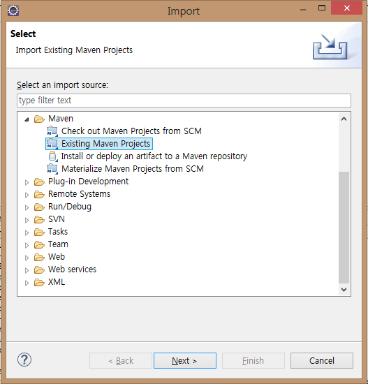
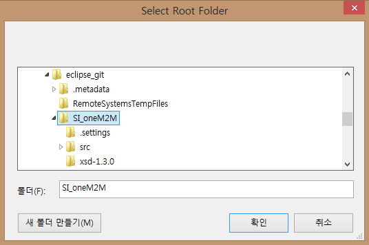
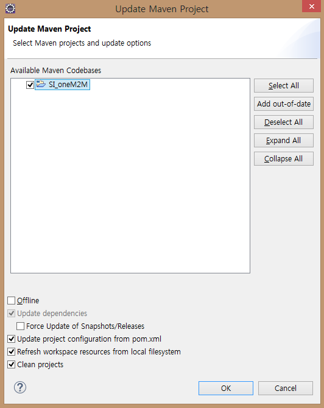
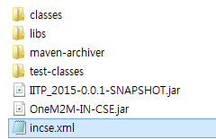

# SI oneM2M 서버 Build

다운받은 SI oneM2M서버 소스를 Eclipse를 이용해서 Build하는 방법을 설명합니다.

Build를 위한 요구조건은 아래와 같습니다.

## Requirements
* JDK 7+ 
* Windows / Linux  
* eclipse
 
Build 실행 순서는 아래와 같습니다.

> 1. 이클립스로 소스 import
> 2. Maven을 이용해서 소스 컴파일
> 3. 설정 파일 추가 및 수정
> 4. oneM2M 서버 실행
> 5. PostMan을 활용한 oneM2M 서버 시험


<br>
<br>
<br>

#### (1) 이클립스로 소스 import
- 메뉴에서 File/Import 메뉴를 선택하여 Import 창을 열어  Maven/Existing Maven Project를 선택한 후 소스가 저장된 폴더를 선택합니다.
- Import된 프로젝트는 아래와 같이 표시됩니다.


<br>


<br>
<br>
#### (2) Maven을 이용한 Build
- Alt+F5 로 Maven Update를 실행합니다. (필요한 외부 라이브러리가 다운로드 됩니다)
- Maven Install 을 실행하여 Build합니다. 실행결과로 아래와 같이 target폴더에 Build된 jar파일이 생성됩니다.


<br>


<br>
<br>
#### (3) 설정 파일 추가 및 수정
- Release 페이지에서 다운받은 설정파일(incse.xml)을 target 폴더에 복사합니다.
- DB설정 등 로컬환경에 맞게 설정파일을 수정합니다. 설정파일에 대한 자세한 내용은 xxx페이지를 참고하세요.

<br>
<br>
#### (4) oneM2M 서버 실행
- target 폴더에서 아래 명령으로 서버를 실행합니다.

 ```
java -jar OneM2M-IN-CSE.jar
 ```

<br>
<br>
#### (5) PostMan을 활용한 oneM2M 서버 시험
- POSTMAN을 활용하여 oneM2M 서버를 시험합니다.
- POSTMAN 시험을 위한 스크립트 파일은 release 페이지에서 다운받을 수 있습니다.
- POSTMAN을 활용한 oneM2M 서버 시험에 관한 자세한 내용은 xxx 페이지에서 확인할 수 있습니다.


<br>
<br>
